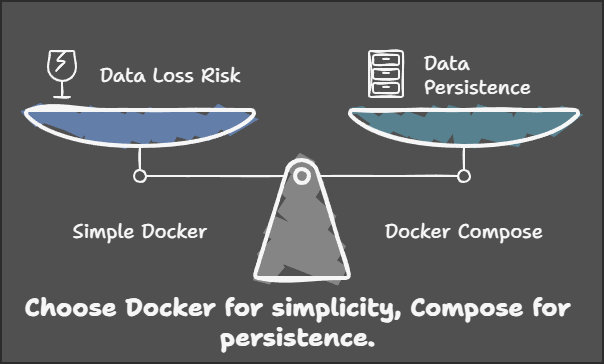

# Calendar-Events

An application to create and retrieve event details

## Steps to run the application:
The application can be run with any of the below method:

### Step 1: Using Docker
This is the simple way to run the application with just 2 docker commands, as mentioned below:
```console
foo@bar:~$ docker build -t pic . 
foo@bar:~$ docker run -p 8000:8000 -it pic
```
Run the above commands in the main folder where Dockerfile is located. They will build a image with name pic and then run it on port 8000 in your machine. in case if you are running anything else on port `8000` in your machine then you can customise `-p` argument in the second command as `-p <custom-port>:8000`.

### Step 2: Using Docker Compose
This requires docker-compose to be installed in your system. The simplicity is that you don't need to run a lot of commands and can manage many things bery easily. The complexity is that the docker-compose.yml file have to be managed for this.
To run application with this method, run the below commands:
```console
foo@bar:~$ docker-compose up -d --build
```
The above command launches the application in detached mode with a rebuild of the Docker images using Docker Compose.

## Which Approach to choose from the above?
1. **Choose Way 1** if you need a simple, quick solution without managing persistent data, and are okay with losing data if the container stops.
2. **Choose Way 2** if you require data persistence, such as when working with databases, and want to ensure your data is safe even if the container crashes.
3. **Consider Way 2** for production environments where data durability is essential, while Way 1 might suit short-term or testing scenarios.



## API Documentation
The API documentation for this application is available via Swagger UI. Once the application is running, you can access it at the following URL:

[http://localhost:8000/docs](http://localhost:8000/docs)

This provides a user-friendly interface to explore and test the application's APIs.

## Available Endpoints

All endpoints are available under the base path `/events`.

1. **Create Event**
   - **Endpoint**: `POST /events/`
   - **Description**: Creates a new event and returns the event details.
   - **Response**: `201 Created` with the event details.

2. **Get Events**
   - **Endpoint**: `GET /events/`
   - **Description**: Retrieves a list of events, optionally filtered by query parameters.
   - **Response**: A list of event details.

3. **Get Event by ID**
   - **Endpoint**: `GET /events/{event_id}`
   - **Description**: Retrieves the details of a specific event by its ID.
   - **Response**: The details of the requested event.
